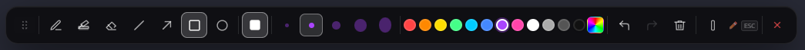
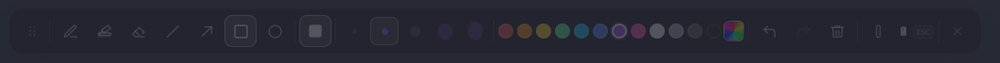
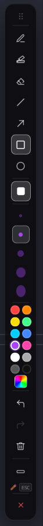

# HoverInk

A lightweight, transparent screen drawing tool built with Go (Wails), React, and TypeScript. HoverInk lets you draw directly on your screen and seamlessly toggle between drawing and interacting with the applications behind it.

## Features

* **Smart Overlay:** 100% transparent, frameless window.
* **Click-Through Mode:** Press `ESC` to lock your drawings and interact with the desktop or apps behind it.
* **Rich Drawing Tools:** Pen, Highlighter, Eraser, Line, Arrow, Rectangle, and Circle.
* **Customization:** Adjustable brush sizes, color palette, and a fill toggle for shapes.
* **History Control:** Full Undo and Redo support, plus a quick "Clear All" action.
* **Floating UI:** Draggable toolbar that can be toggled between horizontal and vertical orientations to fit your workflow.

## Screenshots


**Toolbox States:**
* Active Toolbar: 
* Deactivated (Click-Through) Toolbar: 
* Vertical Mode: 

## Development

Make sure you have [Go](https://go.dev/) and [Node.js](https://nodejs.org/) installed. 

To run the app in live development mode (with fast hot-reload for frontend changes):
```bash
wails dev

```

To run the frontend tests:

```bash
npx vitest run

```

## Building for Production

To build a redistributable, production-ready desktop executable, run:

```bash
wails build

```

*The compiled binary will be placed in the `build/bin` directory.*

---

*Built with [Wails](https://wails.io/), React, and TypeScript.*
